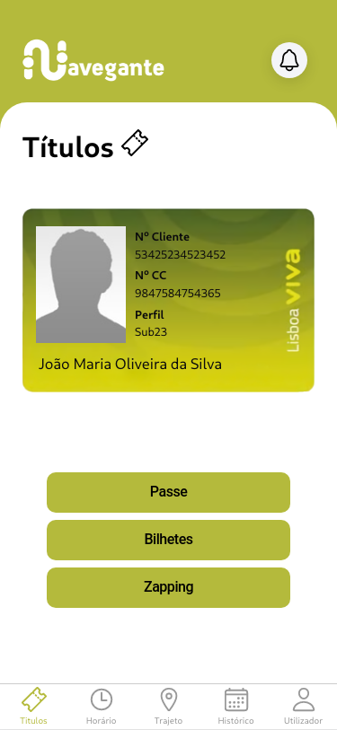

<div style="text-align:center; height:150px; margin:50px"></div>

Navegante is a public tansportation app with the purpose of replacing the tickets while also providing various utilities to ease the use of public trasnportation.

<div style="text-align:center; height:650px; margin:20px"> </div>

## Technologies used

- React
- Ionic

## Compile & Run Instrunctions

1. ```npm install```
2. ```ionic capacitor build <platform ios or android>```
3. Open the platform's IDE and run on the emulator